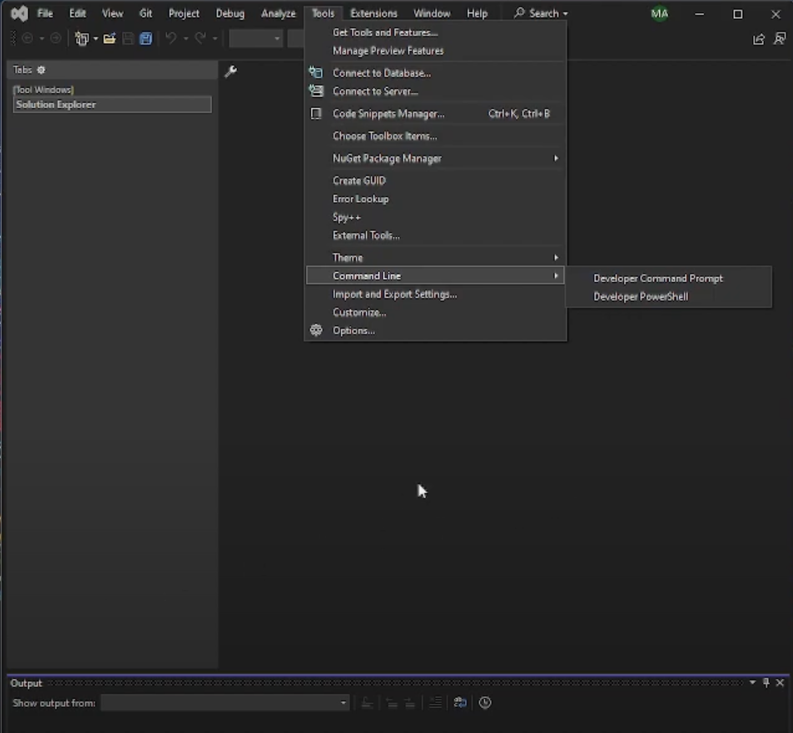
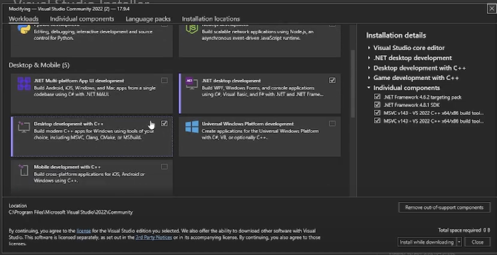
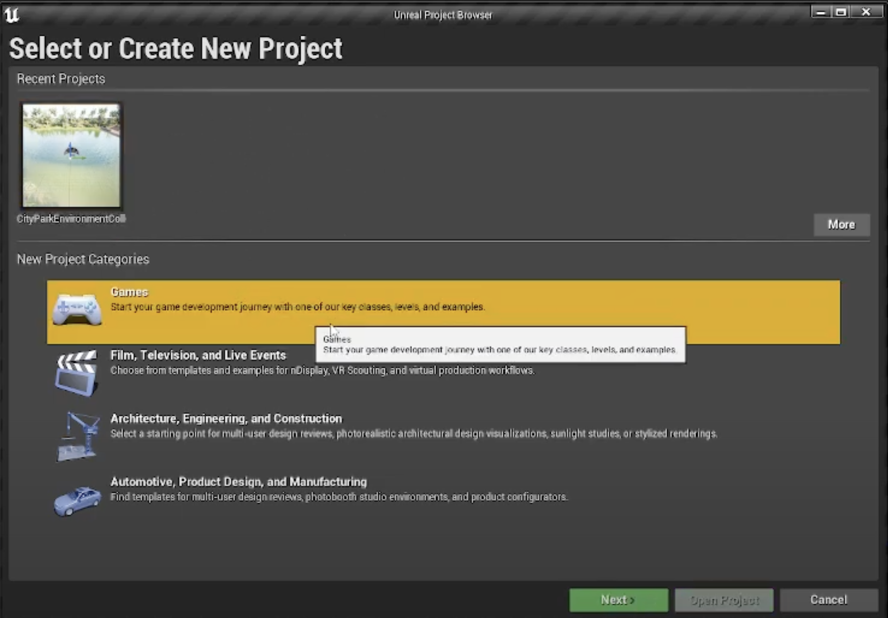
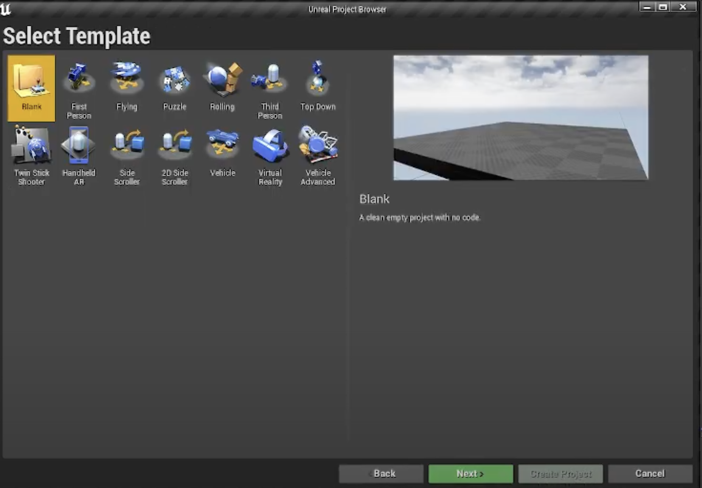
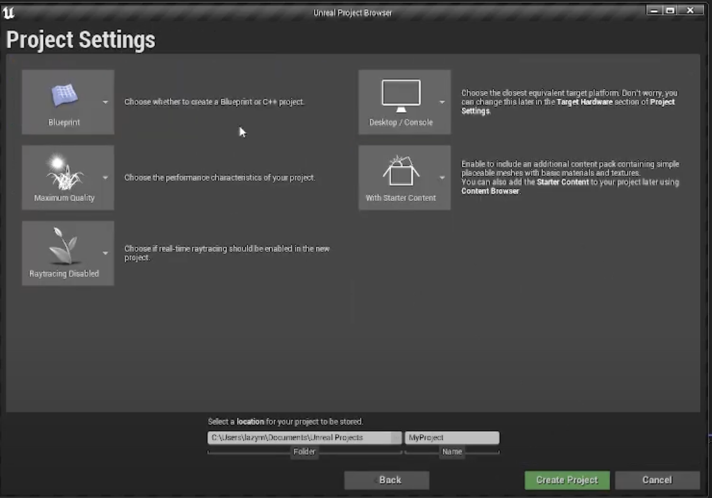
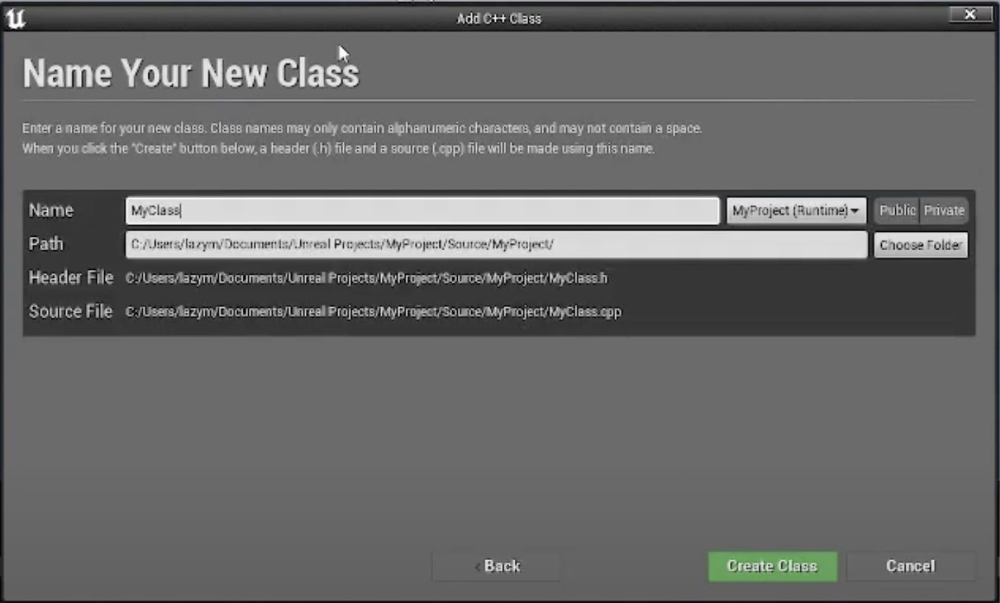
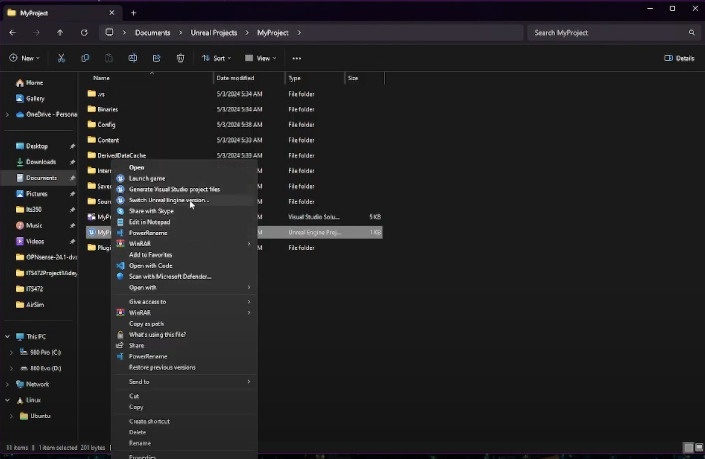
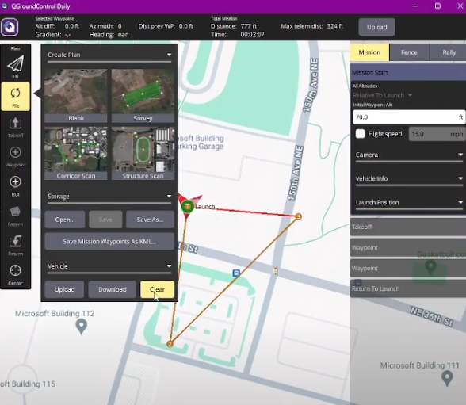
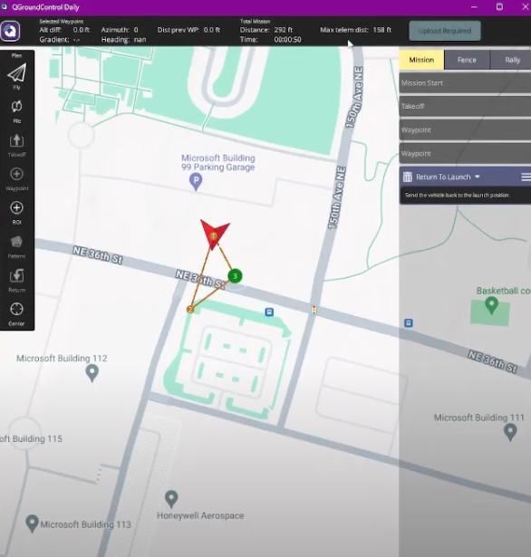

# PX4, AirSim, and Unreal Engine 4.27.2 Setup Tutorial

This guide provides step-by-step instructions to set up PX4, AirSim, and Unreal Engine 4.27.2 on Windows.

---

## Prerequisites

### 1. Install Git
- Download and install Git from [git-scm.com](https://git-scm.com/downloads/win).

### 2. Clone AirSim Repository
```bash
cd Documents
git clone https://github.com/microsoft/AirSim.git
cd AirSim
build.cmd
```

### 3. Install Visual Studio 2022
- Download and install [Visual Studio 2022](https://visualstudio.microsoft.com/).
- Open **Tools** → **Command Line** → **Developer PowerShell**.

  

- In the Visual Studio Installer, check the following workloads:
  - `.NET desktop development`
  - `Desktop development with C++`
  - `Unreal Engine Projects`

  

- Install the required SDKs:
  - Windows 11 SDK (for Windows 11)
  - Windows 10 SDK (for Windows 10)
  - .NET Framework 4.8.1 SDK

---

## Unreal Engine Installation

1. Install the [Epic Games Launcher](https://www.epicgames.com/store/en-US/).
2. In the launcher, go to **Unreal Engine** → **Library** and install **Unreal Engine 4.27.2**.
3. Launch Unreal Engine 4.27.2.
4. On the **Select or Create New Project** screen:
   - Choose **Games** → **Next**.
     
   - Select **Blank** → **Next**.
     
   - Name your project and click **Create Project**.
     

---

## Project Configuration

1. Go to **File** → **New C++ Class**.
   - Select **None** → **Next** → **Create Class**.
     

2. Copy the `Plugins` folder from:
   ```bash
   /Documents/AirSim/Unreal
   ```
   - Paste it into the root directory of your Unreal project (where the `.uproject` file is located).

3. Right-click the `.uproject` file and open it in Visual Studio.

4. Modify the `.uproject` file:
   ```json
   "Type": "Runtime",
   "LoadingPhase": "Default",
   "AdditionalDependencies": [
       "AirSim"
   ]
   ],
   "TargetPlatforms": [
       "MacNoEditor",
       "WindowsNoEditor"
   ],
   "Plugins": [
       {
           "Name": "AirSim",
           "Enabled": true
       }
   ]
   }
   ```

5. Open **Solution Explorer** → **Config** → **DefaultGame.ini**.
   - Add this line at the end:
     ```ini
     +MapsToCook=(FilePath="/AirSim/AirSimAssets")
     ```

6. Generate Visual Studio project files:
   - Navigate to your project folder, right-click, and select **Show More Options** → **Generate Visual Studio project files**.
     

7. Open the `.sln` file in Visual Studio and click **Local Windows Debugger** to run.

---

## AirSim Settings

1. Navigate to:
   ```bash
   ~/Documents/AirSim
   ```
   - Create a `settings.json` file:
     ```bash
     notepad settings.json
     ```

2. Add the following content to `settings.json`:
   ```json
   {
       "SettingsVersion": 1.2,
       "SimMode": "Multirotor",
       "ClockType": "SteppableClock",
       "Wind": {
           "X": 14,
           "Y": 0,
           "Z": 0
       },
       "Vehicles": {
           "PX4": {
               "VehicleType": "PX4Multirotor",
               "UseSerial": false,
               "Lockstep": true,
               "UseTcp": true,
               "QgcHostIp": "",
               "TcpPort": 4560,
               "ControlIp": "YOUR_CONTROL_HOST_IP",
               "UdpPort": 14580,
               "LocalHostIp": "YOUR_LOCAL_HOST_IP",
               "Sensors": {
                   "barometer": {
                       "SensorType": 1,
                       "Enabled": true,
                       "PressureFactorSigma": 0.0001825
                   }
               },
               "Parameters": {
                   "LPE_LAT": 41.584396214649464,
                   "LPE_LON": -87.47620888056967
               }
           }
       }
   }
   ```

---

## PX4 Setup with WSL2

1. Install WSL:
   ```bash
   wsl --install
   ```
2. Install Ubuntu in WSL:
   ```bash
   wsl -d Ubuntu
   ```
3. Navigate to the Desktop:
   ```bash
   cd /mnt/c/Users/<YourUsername>/Desktop
   ```
4. Clone the PX4 source code:
   ```bash
   git clone https://github.com/PX4/PX4-Autopilot.git --recursive
   cd PX4-Autopilot
   ```
5. Run the setup script:
   ```bash
   bash ./Tools/setup/ubuntu.sh
   ```
6. Add this to `~/.bashrc`:
   ```bash
   export PX4_SIM_HOST_ADDR=YOUR_LOCAL_HOST_IP
   ```
7. Build PX4:
   ```bash
   make px4_sitl none_iris
   ```

---

## Running the Simulation

1. Launch your Unreal Engine project and click **Play**.
2. Open WSL and run:
   ```bash
   make px4_sitl none_iris
   ```
3. Install [QGroundControl](https://qgroundcontrol.com).
   - Configure **Comm Links**:
     ```text
     Name: WSL2
     Type: UDP
     Port: 14580
     Server Addresses (optional): {YOUR_CONTROL_HOST_IP}:14580
     ```

4. Start the stack in this order:
   1. Play your Unreal Engine project.
   2. Run PX4:
      ```bash
      make px4_sitl none_iris
      ```
   3. Launch QGroundControl.

---

## Running the Full Stack

Start the components in the following order:

1. **Play Your Unreal Engine Project**
   - Open your Unreal Engine project and press **Play**.

2. **Start PX4**
   - Open WSL and run:
     ```bash
     make px4_sitl none_iris
     ```

3. **Launch QGroundControl**
   - Open QGroundControl to manage the drone.

---

## Using QGroundControl

1. **Clear Existing Flight Paths**
   - Go to **File** → **Clear**.
     
     

2. **Takeoff and Waypoints**
   - Click **Takeoff**.
   - Use the interface to set at least two waypoints on the map.
   - Click **Upload Required** to confirm the waypoints.

     

3. **Start the Flight**
   - Slide the **Takeoff** slider to the right to begin the flight.

     

4. **Observe the Flight**
   - The drone will follow the flight path set in QGroundControl and display its movement in Unreal Engine.

--- 

This setup ensures seamless integration of PX4, AirSim, and Unreal Engine with QGroundControl for managing and simulating drone flights.

---

## Additional Commands

### For PX4
- **Takeoff**:
  ```bash
  commander takeoff
  ```
- **Land**:
  ```bash
  commander land
  ```

---

Enjoy flying your simulated drone with PX4, AirSim, and Unreal Engine!
