# 🚀 PX4, AirSim, and Unreal Engine 4.27.2 Setup Tutorial

This guide provides step-by-step instructions to set up PX4, AirSim, and Unreal Engine 4.27.2 on Windows.

---

## 🎯 Prerequisites

### 1️⃣ Install Git
- Download and install Git from [git-scm.com](https://git-scm.com/downloads/win).

### 2️⃣Install Visual Studio 2022
- Download and install [Visual Studio 2022](https://visualstudio.microsoft.com/).

- In the Visual Studio Installer, check the following workloads:
  - `.NET desktop development` ✔️
  - `Desktop development with C++` ✔️
  - `Unreal Engine Projects` ✔️

  

- Install the required SDKs:
  - ✅ Windows 11 SDK (for Windows 11)
  - ✅ Windows 10 SDK (for Windows 10)
  - ✅ .NET Framework 4.8.1 SDK

- Open **Tools** → **Command Line** → **Developer PowerShell**.

  

- When cloning the AirSim Repository, run it inside the Developer PowerShell. The Visual Studio tools are needed to run the build.cmd

### 3️⃣ Clone AirSim Repository


```bash
cd Documents
git clone https://github.com/microsoft/AirSim.git
cd AirSim
build.cmd
```

## 🛠️ Unreal Engine Installation

1. Install the [Epic Games Launcher](https://www.epicgames.com/store/en-US/).
2. Go to **Unreal Engine** → **Library** and install **Unreal Engine 4.27.2**.
3. Launch Unreal Engine 4.27.2.
4. On the **Select or Create New Project** screen:
   - Choose **Games** → **Next**.
     
   - Select **Blank** → **Next**.
     
   - Name your project and click **Create Project**.
     

---

## 🔧 Project Configuration

1. Go to **File** → **New C++ Class**.
   - Select **None** → **Next** → **Create Class**.
     

2. Copy the `Plugins` folder from:
   ```bash
   /Documents/AirSim/Unreal
   ```
   - Paste it into the root directory of your Unreal project (where the `.uproject` file is located).

3. Right-click the `.uproject` file and open it in Visual Studio.

4. Modify the `.uproject` file to include AirSim as a dependency:
   ```json
   "Type": "Runtime",
   "LoadingPhase": "Default",
   "AdditionalDependencies": [
       "AirSim"
   ],
   "TargetPlatforms": [
       "MacNoEditor",
       "WindowsNoEditor"
   ],
   "Plugins": [
       {
           "Name": "AirSim",
           "Enabled": true
       }
   ]
   }
   ```

5. Open **Solution Explorer** → **Config** → **DefaultGame.ini**.
   - Add this line at the end:
     ```ini
     +MapsToCook=(FilePath="/AirSim/AirSimAssets")
     ```

6. Generate Visual Studio project files:
   - Right-click your project folder and select **Show More Options** → **Generate Visual Studio project files**.
     

7. Open the `.sln` file in Visual Studio and click **Local Windows Debugger** to run.

---

## 🌐 AirSim Settings

1. Navigate to:
   ```bash
   ~/Documents/AirSim
   ```
   - Create a `settings.json` file:
     ```bash
     notepad settings.json
     ```

2. Add the following content to `settings.json`:
   ```json
   {
       "SettingsVersion": 1.2,
       "SimMode": "Multirotor",
       "ClockType": "SteppableClock",
       "Wind": {
           "X": 14,
           "Y": 0,
           "Z": 0
       },
       "Vehicles": {
           "PX4": {
               "VehicleType": "PX4Multirotor",
               "UseSerial": false,
               "Lockstep": true,
               "UseTcp": true,
               "QgcHostIp": "",
               "TcpPort": 4560,
               "ControlIp": "YOUR_CONTROL_HOST_IP",
               "UdpPort": 14580,
               "LocalHostIp": "YOUR_LOCAL_HOST_IP",
               "Sensors": {
                   "barometer": {
                       "SensorType": 1,
                       "Enabled": true,
                       "PressureFactorSigma": 0.0001825
                   }
               },
               "Parameters": {
                   "LPE_LAT": 41.584396214649464,
                   "LPE_LON": -87.47620888056967
               }
           }
       }
   }
   ```

---

## 🌍 Finding Your Control Host IP and Local Host IP

Before configuring your simulation, you need to find the following:

1. **Control Host IP**: The IP address of the host running the simulation.
2. **Local Host IP**: The IP address of your Windows machine for local communication.

---

### 🔍 Steps to Find the Local Host IP

1. Open **Windows PowerShell** or **Command Prompt**.
2. Run the following command:
   ```bash
   ipconfig
   ```
3. Look under the **Ethernet adapter** or **Wi-Fi** section for the line labeled **IPv4 Address**. This is your **Local Host IP**.

   Example:
   
   

---

### 🔍 Steps to Find the Control Host IP (WSL IP)

1. Open your WSL2 terminal (e.g., Ubuntu).
2. Run the following command to find the IP address for WSL:
   ```bash
   ifconfig
   ```
3. Look for the `eth0` section and find the **inet** address. This is your **Control Host IP**.

   Example:
  

---

### 📌 Why These IPs Are Important

- **Local Host IP**: Used to configure PX4 to communicate with your Unreal Engine project running on the Windows host.
- **Control Host IP**: Used to set up communication between PX4 in WSL and external tools like QGroundControl.

## 🐧 PX4 Setup with WSL2

**What is WSL2 and Why Do We Need It?**
- **WSL2 (Windows Subsystem for Linux 2)** allows running a Linux environment on Windows. PX4 relies on Linux tools for simulation and WSL2 provides an efficient way to integrate these with Windows-based tools like Unreal Engine and QGroundControl.

### Steps:
1. Install WSL:
   ```bash
   wsl --install
   ```
2. Install Ubuntu in WSL:
   ```bash
   wsl -d Ubuntu
   ```
3. Navigate to the Desktop:
   ```bash
   cd /mnt/c/Users/<YourUsername>/Desktop
   ```
4. Clone the PX4 repository:
   ```bash
   git clone https://github.com/PX4/PX4-Autopilot.git --recursive
   cd PX4-Autopilot
   ```
5. Run the setup script:
   ```bash
   bash ./Tools/setup/ubuntu.sh
   ```
6. Add this to `~/.bashrc`:
   ```bash
   export PX4_SIM_HOST_ADDR=YOUR_LOCAL_HOST_IP
   ```
7. Build PX4:
   ```bash
   make px4_sitl none_iris
   ```

---

## 🎮 Running the Simulation

1. Launch your Unreal Engine project and click **Play**. 🎮
2. Open WSL to run and build:
   ```bash
   make px4_sitl none_iris
   ```
3. Install and configure [QGroundControl](https://qgroundcontrol.com). 🚁
4. Start the stack in this order:
   1. Play Unreal Engine project.
   2. Run PX4 in WSL.
   3. Launch QGroundControl.

---

## ❓ What If I Use Custom Software Instead of QGroundControl?

If you decide to replace **QGroundControl (QGC)** with custom software designed to only interface with the PX4 SITL port, the communication principles remain the same. Here's how it works:

---

### 📡 What Communication Protocol Is Needed?

- **Protocol**: The PX4 SITL communicates using the **MAVLink protocol**.
  - MAVLink is a lightweight messaging protocol for communication between drones and ground control systems.
  - By default, PX4 SITL sends MAVLink messages over **UDP port 14580**.
  - If you replace QGC, your custom software will also need to use the **UDP protocol** to listen to and send MAVLink messages on this port.

- **Reference Port**: UDP **14580** is the default port configured in PX4 for MAVLink communication. If you do not override this in PX4’s `settings.json`, your custom software must use this port.

---

### 🔑 Key Steps for Custom Software Integration

1. **Communicate via MAVLink Protocol**:
   - Use the **MAVLink protocol** to interface with PX4 SITL.
   - MAVLink handles various commands like arming the drone, initiating takeoff, setting waypoints, and landing.

2. **Use UDP Port 14580**:
   - Your software must bind to **UDP port 14580** to receive MAVLink messages from PX4.
   - Example in Python:
     ```python
     from pymavlink import mavutil

     # Connect to PX4 SITL via UDP port 14580
     connection = mavutil.mavlink_connection('udp:localhost:14580')
     print("Connected to MAVLink...")
     ```

3. **Configure PX4 (if needed)**:
   - Confirm that the `settings.json` file in PX4 is set to use the default port:
     ```json
     "UdpPort": 14580
     ```

4. **Send and Receive MAVLink Messages**:
   - Your software can send MAVLink commands (e.g., arm, takeoff, land) and receive telemetry or status updates from PX4.

---

### 📚 Reference Documents

1. **MAVLink Protocol Documentation**:
   - Learn more about MAVLink messages and their structure:
     - [MAVLink 2 Protocol](https://mavlink.io/en/)
     - [PX4 MAVLink Commands](https://docs.px4.io/main/en/middleware/mavlink.html)

2. **pymavlink Library Documentation**:
   - For integrating MAVLink in Python:
     - [pymavlink Documentation](https://github.com/ArduPilot/pymavlink)

3. **PX4 Documentation**:
   - Official PX4 SITL and MAVLink configuration:
     - [PX4 SITL Documentation](https://docs.px4.io/main/en/simulation/)

---

### 🧩 Why It Still Uses UDP on Port 14580

- PX4 SITL uses MAVLink as its default protocol and UDP as its communication method.
- Replacing QGC with a custom software solution doesn't change the protocol (MAVLink) or the communication method (UDP). The custom software needs to adhere to these standards to interface correctly with PX4.
- **Advantages of Using UDP**:
  - Lightweight and fast for real-time drone communication.
  - Easy to configure and widely supported in development environments.

---

## 📊 Visualizing the Stack

```mermaid
graph TD
    subgraph User Interaction
        A[Play Unreal Engine Project 🎮]
        B[Set Waypoints in QGroundControl 🚁]
    end
    
    subgraph Simulation Stack
        C[Unreal Engine 4.27.2]
        D[AirSim Plugin]
        E[PX4 SITL in WSL 🐧]
        F[QGroundControl 🚁]
    end
    
    subgraph Communication
        G[UDP Communication 📡]
    end

    A --> C
    C --> D
    D --> E
    E --> G
    G --> F
    B --> F
```


